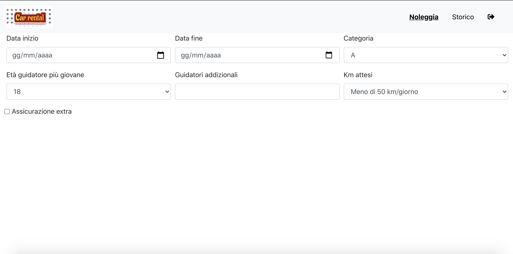

# CAR RENTAL

## React client application routes

- Route `/`:
  - page content: empty
    - purpose: is used to redirect to another route if the user is not authenticated redirect to /vehicles else rediret to /configuration

- Route `/vehicles`:
  - page content:  navBar for authentication a table that shows all vehicles  and a filter to filter vehicles for
         brands and categories.
    - purpose: it allows the user so see all vehicles and filter them

- Route `/configuration`:
  - page content: navBar to navigate, a form to compile for recive a rental solution and a table that summarize the rental solution
    - purpose: it allows the user to generete a rental solution

- Route `/rentals`:
  - page content: contains all user's rentals that could be booking(endDate of rental > today) or archived (endDate of rental > today)
  - purpose:it allows the user to look archived rentals or delete bookings

- Route `/login`:  
  - page content: contains a form for user authentication
  - purpose:it allows the user to authenticate

## REST API server

- GET `/api/vehicles`
  - Request params: categories and brands
  - Response body: vehicles
  - Error: 500Error (DB)
- GET `/api/brands`
  - Request body: empty
  - Response body: object that have as properties brand: value
  - Error: 500 Error(DB)

- GET `/api/categories`
  - Request body: empty
  - Response body: object that have as properties category: value
  - Error: 500 Error(DB)

- POST `/api/login`
  - Request body: object containing user's credentials
  - Response body: {userID: userObj.userID, email: userObj.email}
  - Errors: authErrorObj

- POST `/api/logout`
  - Request body: empty
  - Response body: empty

- GET `/api/user`
  - Request body: userID
  - Response body: { id: user.userID, email: user.email }
  - Error: 401 Error

- POST `/api/configuration`
  - Request body: object contais all params for a configuration
  - Response body:  { vehicles: values[0].numV, price: price }(object with num vehicles and price for configuration)
  - Errors: 400(emptyMessage)/ 404(No solutions have been found for the rental)/ 422(validation of req.body) /500(DB comunication)

- POST `/api/payment`
  - Request body: object contais all params for a fake payment
  - Response body: empty
  - Errors: 400(emptyMessage)/ 422(validation of req.body)

- POST `/api/rentals`
  - Request body: object contais all params for new Rental
  - Response body: empty
  - Errors: 400(emptyMessage)/ 409(price wrong)/500(Db comunication)

- GET `/api/rentals`
  - Request body: empty
  - Response body: a cumstom rental object
  - Error: 404(rentals not founded for that user)500 Error

- DELETE `/api/rentals/bookings/:id`
  - Request parameters: id of rental
  - Response body: empty
  - Error: 500 Error

## Server database

- Table `Rental` - contains rentalID userID vehicleID startDate endDate price
- Table `User` - contains userID email password
- Table `Vehicle` - contains vehicleID brand model category

## Main React Components

- All compents ar in(`/client/src/components`)

- `Configurator` (in `Configurator.js`):
  - component purpose: it allows the user to generate a rental solution by filling in the appropriate form.
  - main functionality: component used to implement the configurator functions.

- `Filter` (in `Filter.js`)
  - component purpose: it allows the user to filter vehicles for brands and categories.
  - main functionality: component used to implement the filtering functions.
- `ModalPayment`(in `ModalPayment.js`)
  - component purpose: it allows the user to make a booking.
  - main functionality: component used to implement the payment functions.

- `History`(in `History.js`)
  - component purpose: it allows the user to look archived rentals or delete bookings.
  - main functionality: component used to implement the delete functions.

## Screenshot

## Test users

* andrea@live.it, password: "password" (frequent customer)
* lorenzo@live.it, password : "password"

## Follow these steps to setup the project locally

------------

1. Clone this repo ( Use `git clone ...`)
2. Install node v12.16
3. Install dependecy from package.json (both on client and server directory) `npm install`
4. Run server (`npm start`) then start client (`npm start`)

## Follow these steps to setup the project on Docker

------------

1. Clone this repo ( Use `git clone ...`)
2. Install Docker
3. Check docker-compose.yml for configuration e then `docker-compose up -d`
4. FE is listening on port 8080
